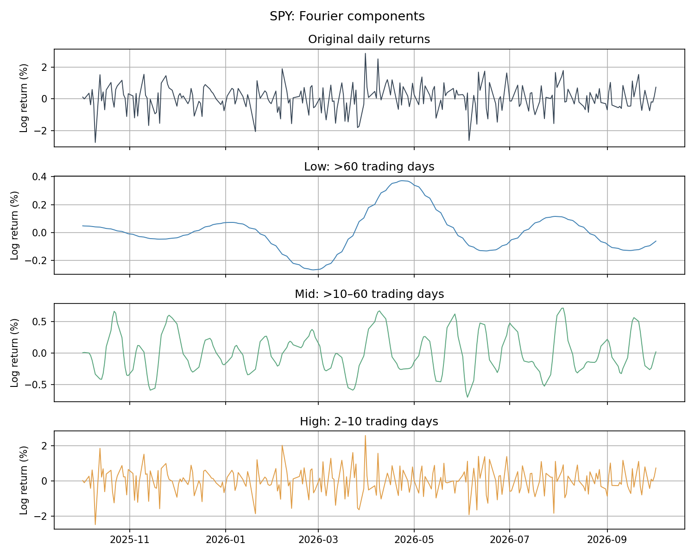

# Fourier Decomposition of Stock Returns

## Idea

Daily SPY log returns are treated as a discrete-time signal. The FFT changes
coordinates from the time domain to the Fourier basis. Separating coefficients
by period and applying inverse FFT reveals how low-, mid-, and high-frequency
components combine to form the observed returns. The low-frequency component
is then compared with causal SMA and EMA filters matched to its cutoff.

**Returns → FFT → frequency masks → inverse FFT → low / mid / high components**

## Mathematics

For adjusted close prices, define daily log returns and remove their sample mean:

$$r_t=\log P_t-\log P_{t-1},\qquad x_t=r_t-\bar r,\qquad X=\operatorname{FFT}(x).$$

For nonzero bin k, frequency is $f_k=k/N$ cycles per trading day and period is
$T_k=N/k$ trading days. The bands are:

| Low | Mid | High |
|---|---|---|
| T > 60 days | 10 < T ≤ 60 days | 2 ≤ T ≤ 10 days |

For each band B, retain its coefficients and zero the rest:

$$X_B[k]=\begin{cases}X[k],&k\in B\\0,&k\notin B,\end{cases}
\qquad x_B=\operatorname{IFFT}(X_B).$$

NumPy `rfft`/`irfft` preserve real-valued reconstruction; their consistent use
makes the opposite forward-sign convention from Strang immaterial here.

## Results

**Exact reconstruction.** For 2,954 SPY returns spanning January 2015–October
2026, $x_{low}+x_{mid}+x_{high}\approx x$ with maximum absolute error
**4.163 × 10⁻¹⁷**. The bands partition one Fourier representation; they are not
three unrelated smoothed series.

**Power spectrum.** Squared coefficient magnitudes show how the signal is
represented across periods; the shaded regions identify the chosen bands.


**Distinct time scales.** The low component varies slowly, the mid component
oscillates over intermediate horizons, and the high component contains rapid
fluctuations. Each panel has its own vertical scale.



**Cumulative shape.** The low component follows much of the broad cumulative
shape: rapid oscillations tend to cancel when summed, while slower movements
persist. These are cumulative **demeaned log returns**, not the SPY price path;
adding all three cumulative components recovers the path within **3.067 × 10⁻¹⁵**.


**Same cutoff, different responses.** At $\omega_c=2\pi/60$, an integer-window
search selects **SMA27** with gain **0.699**, while **EMA with α = 0.099337061**
has gain **0.707**, matching $1/\sqrt{2}$ (approximately −3 dB); its equivalent
span is **19.13**, not 60. The sharp FFT mask differs from the SMA's roll-off
and side lobes and the EMA's monotonic roll-off; causal filtering introduces
lag relative to the offline reconstruction. The sample mean is restored to
the FFT low component in this comparison so all curves have the same DC level.


## What this project shows

Fourier decomposition separates an observed return signal exactly into chosen
time-scale bands. Slow components describe persistent variation within the
sample; higher frequencies describe increasingly rapid fluctuations. Causal
SMA and EMA target similar slower behavior, but matching the cutoff does not
match their full magnitude or phase responses to the offline FFT mask.

## Limitations

- Full-sample FFT is offline and uses the whole observation window.
- Periodic extension and sharp masks can produce ringing and endpoint effects.
- The 10-day and 60-day boundaries are illustrative choices.
- Decomposition alone does not imply predictability.

## Run

```bash
python scripts/run_notebooks.py
```
