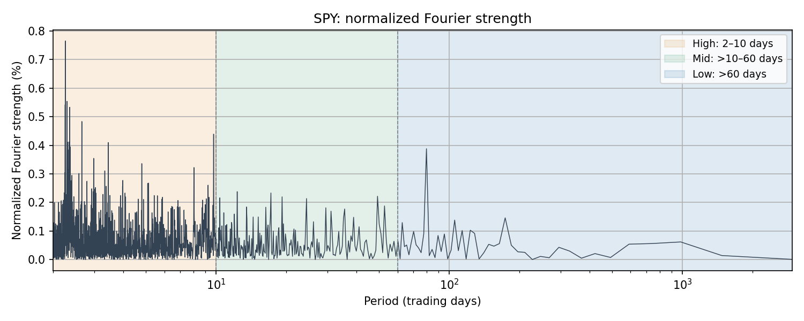
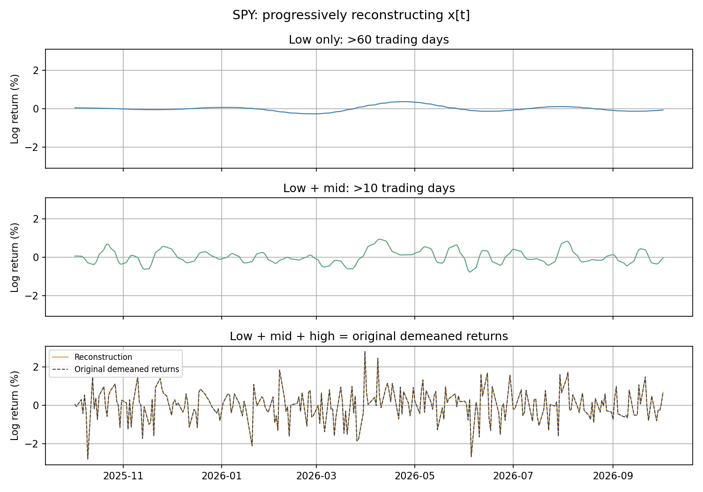
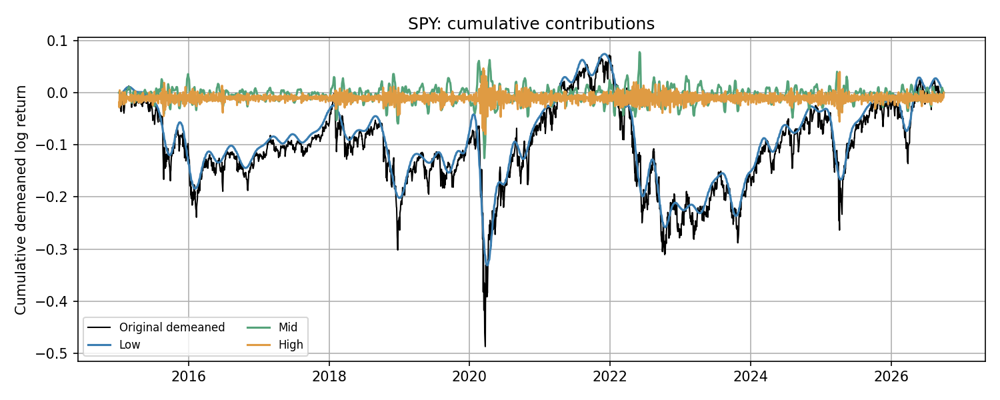
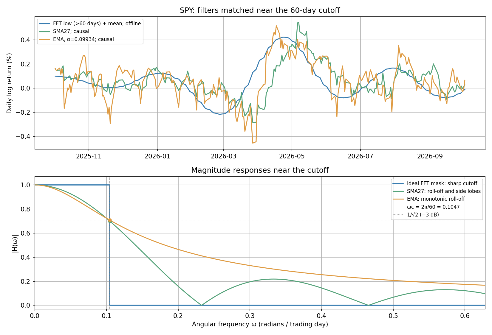

# Frequency-Domain Analysis of Stock Returns

This project treats daily SPY log returns as a discrete-time signal and studies them in the Fourier basis.

The main idea is simple:

**returns → FFT → frequency bands → inverse FFT → reconstructed time-scale components**

Instead of using the FFT only to plot a spectrum, I use it to split the observed return signal into low-, medium-, and high-frequency components and then reconstruct each component back in the time domain.

I also compare the low-frequency Fourier reconstruction with causal SMA and EMA filters.

---

## 1. From returns to Fourier coordinates

For adjusted closing price \(P_t\), daily log return is

$$
r_t = \log P_t - \log P_{t-1}.
$$

Before applying the FFT, I remove the sample mean:

$$
x_t = r_t - \bar r.
$$

The FFT changes coordinates from the time domain to the Fourier basis:

$$
x_t
\quad \longrightarrow \quad
X_k.
$$

For a sample of length \(N\), Fourier bin \(k\) corresponds approximately to

$$
f_k = \frac{k}{N}
$$

cycles per trading day, or equivalently to period

$$
T_k = \frac{N}{k}
$$

trading days.

This makes the Fourier coefficients easy to interpret by time scale.

---

## 2. Frequency bands

I separate the Fourier coefficients into three period ranges:

| Component | Period |
|---|---:|
| Low frequency | \(T > 60\) trading days |
| Mid frequency | \(10 < T \le 60\) trading days |
| High frequency | \(2 \le T \le 10\) trading days |

60 trading days is an illustrative approximation to a three-month trading horizon.
10 trading days is an illustrative short-horizon boundary. These thresholds are
chosen for interpretation, not estimated from the data.

For example, the low-frequency spectrum is

$$
X_k^{low} =
\begin{cases}
X_k, & T_k > 60, \\
0, & \text{otherwise}.
\end{cases}
$$

The same masking procedure gives \(X^{mid}\) and \(X^{high}\).

Applying the inverse FFT gives the corresponding time-domain signals:

$$
x^{low}_t = \text{IFFT}(X^{low}),
$$

$$
x^{mid}_t = \text{IFFT}(X^{mid}),
$$

$$
x^{high}_t = \text{IFFT}(X^{high}).
$$

Because the masks partition the Fourier coefficients,

$$
x_t
\approx
x_t^{low}
+
x_t^{mid}
+
x_t^{high}.
$$

In the actual calculation, the maximum reconstruction error is approximately

$$
4.2 \times 10^{-17},
$$

so the original demeaned return signal is recovered to floating-point precision.

---

## 3. Normalized Fourier strength

X[k] is the Fourier coefficient, or projection onto Fourier direction k;
|X[k]|² is its squared strength. The normalized value

$$p_k=\frac{|X[k]|^2}{\sum_j |X[j]|^2}$$

is the fraction of total squared magnitude associated with that bin, using the
retained `rfft` coefficients. The plot shows $100p_k$ against period.



---

## 4. Progressive reconstruction

The three panels add low, then mid, then high frequencies over the same date
window and with identical vertical limits. The last panel overlays the sum
with the original demeaned returns, making the identity visible:

$$x[t]=x_{low}[t]+x_{mid}[t]+x_{high}[t].$$



These are pieces of the same Fourier representation, not unrelated smoothers.

---

## 5. Cumulative contribution of each component

Daily returns are noisy, so the decomposition becomes easier to interpret after cumulative summation.



The low-frequency component follows much of the broad shape of the cumulative demeaned return path.

The intuition is straightforward: high-frequency components change sign frequently, so much of their effect cancels when summed over long intervals. Low-frequency components persist for longer periods and therefore contribute more strongly to the large-scale shape.

These curves are cumulative **demeaned log returns**, not the SPY price itself.

---

## 6. Fourier filtering vs. SMA and EMA

The Fourier decomposition above uses a sharp low-frequency cutoff:

$$
T > 60 \text{ trading days}.
$$

Its cutoff angular frequency is

$$
\omega_c = \frac{2\pi}{60}.
$$

To make the comparison with time-domain filters more meaningful, I choose SMA and EMA parameters whose gain is approximately

$$
\frac{1}{\sqrt{2}}
$$

at the same cutoff frequency.

This gives approximately:

$$
M_{SMA} = 27,
$$

and

$$
\alpha_{EMA} \approx 0.0993.
$$

The EMA parameter corresponds to an effective span of about 19.1 observations.



The FFT low-pass uses a sharp mask and the full sample: it is an offline
decomposition. SMA and EMA are causal filters with smoother roll-off and lag.
Matching the cutoff does not make the reconstructed curves identical.

---

## 7. Main takeaways

This project demonstrates four basic Signals & Systems ideas on a financial time series:

1. **FFT as a change of basis.**  
   Daily returns can be represented by Fourier coefficients instead of time-domain samples.

2. **Frequency-domain masking.**  
   Fourier coefficients can be separated according to their associated periods.

3. **Inverse reconstruction.**  
   Low-, mid-, and high-frequency components can be transformed back into the time domain and sum to the original demeaned signal.

4. **Frequency-domain vs. causal filtering.**  
   A sharp Fourier cutoff, SMA, and EMA all isolate slower variation, but they have different frequency responses and different causality properties.

The project is a signal-decomposition study, not a forecasting model or trading strategy.

---

## Limitations

The full-sample FFT decomposition is retrospective.

- It uses the complete sample rather than only information available at each historical date.
- A finite FFT treats the sample as periodically extended, so endpoints can create wraparound effects.
- Sharp frequency masks can produce ringing.
- The 10-day and 60-day boundaries are illustrative choices rather than economically estimated parameters.
- Separating a return series by frequency does not by itself imply predictability or trading alpha.

---

## Repository

```text
frequency-domain-analysis/
├── README.md
├── requirements.txt
├── data/
├── figures/
├── notebooks/
│   ├── 01_fft_decomposition.ipynb
│   └── 02_filter_comparison.ipynb
├── scripts/
└── src/
    ├── data.py
    ├── fourier.py
    └── filters.py
```

The notebooks keep the main mathematical objects visible in code:

```python
x = returns - returns.mean()

X = np.fft.rfft(x)
power = np.abs(X) ** 2
p = power / power.sum()

X_low = np.where(low_mask, X, 0)
x_low = np.fft.irfft(X_low, n=len(x))
```

NumPy uses the opposite sign convention from the Fourier matrix convention used in my linear algebra notes; using `rfft` and `irfft` consistently gives the same real-valued reconstruction.

---

## Run

Install the dependencies in `requirements.txt`, then run the notebooks or execute:

```bash
python scripts/run_notebooks.py
```